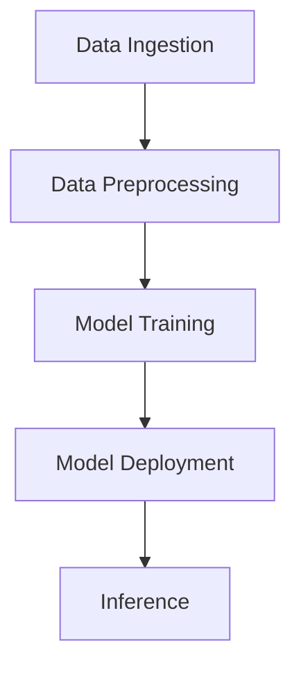

# ML System Design for Content Filtering

## Overview
This document provides an in-depth exploration of the machine learning (ML) system for filtering harmful content. The system is designed to identify and mitigate harmful content in various formats, including text and images, using state-of-the-art ML techniques. Each section includes detailed explanations, examples, and code snippets to guide the reader through the design process.

---

## 1. Data Preprocessing
### Text Data
Data preprocessing is a critical step in preparing text data for machine learning models. It ensures that the data is clean, consistent, and ready for analysis.

#### Tokenization
Tokenization involves splitting text into smaller units, such as words or subwords. For example:

```python
from transformers import AutoTokenizer

text = "Harmful content must be filtered effectively."
tokenizer = AutoTokenizer.from_pretrained("bert-base-uncased")
tokens = tokenizer.tokenize(text)
print(tokens)
# Output: ['harmful', 'content', 'must', 'be', 'filtered', 'effectively', '.']
```

#### Normalization
Normalization converts text to a standard format. This includes converting to lowercase, removing special characters, and normalizing Unicode:

```python
import unicodedata
import re

def normalize_text(text):
    text = text.lower()
    text = unicodedata.normalize('NFKD', text)
    text = re.sub(r'[^\w\s]', '', text)
    return text

example = "Harmful Content!"
print(normalize_text(example))
# Output: 'harmful content'
```

#### Stopword Removal
Stopwords are common words (e.g., "the", "is") that add little value to the analysis. Removing them reduces noise:

```python
from nltk.corpus import stopwords
from nltk.tokenize import word_tokenize

stop_words = set(stopwords.words('english'))
words = word_tokenize("This is an example of harmful content.")
filtered_words = [w for w in words if w.lower() not in stop_words]
print(filtered_words)
# Output: ['example', 'harmful', 'content']
```

#### Embedding
Embeddings convert text into numerical vectors. Pre-trained embeddings like BERT capture contextual meaning:

```python
from transformers import BertModel, BertTokenizer

model = BertModel.from_pretrained("bert-base-uncased")
tokenizer = BertTokenizer.from_pretrained("bert-base-uncased")
inputs = tokenizer("Harmful content", return_tensors="pt")
outputs = model(**inputs)
print(outputs.last_hidden_state.shape)
# Output: torch.Size([1, 3, 768])
```

### Image Data
Image preprocessing ensures that images are in a consistent format for model training.

#### Resizing
Standardize image dimensions:

```python
from PIL import Image

image = Image.open("example.jpg")
image = image.resize((224, 224))
image.show()
```

#### Normalization
Scale pixel values:

```python
import numpy as np

image_array = np.array(image) / 255.0
print(image_array.shape)
# Output: (224, 224, 3)
```

#### Augmentation
Augmentation increases dataset diversity:

```python
from torchvision import transforms

transform = transforms.Compose([
    transforms.RandomHorizontalFlip(),
    transforms.RandomRotation(10),
    transforms.ColorJitter(brightness=0.2, contrast=0.2, saturation=0.2, hue=0.2)
])
augmented_image = transform(image)
augmented_image.show()
```

---

## 2. Model Architecture
### Text Classification
Transformer-based models like BERT are ideal for text classification tasks.

#### Example Architecture
```python
from transformers import BertForSequenceClassification

model = BertForSequenceClassification.from_pretrained("bert-base-uncased", num_labels=2)
print(model)
```

### Image Classification
Convolutional Neural Networks (CNNs) are widely used for image classification.

#### Example Architecture
```python
import torch.nn as nn

class SimpleCNN(nn.Module):
    def __init__(self):
        super(SimpleCNN, self).__init__()
        self.conv1 = nn.Conv2d(3, 16, kernel_size=3, stride=1, padding=1)
        self.pool = nn.MaxPool2d(kernel_size=2, stride=2, padding=0)
        self.fc1 = nn.Linear(16 * 112 * 112, 10)

    def forward(self, x):
        x = self.pool(F.relu(self.conv1(x)))
        x = x.view(-1, 16 * 112 * 112)
        x = self.fc1(x)
        return x

model = SimpleCNN()
print(model)
```

---

## 3. Training Pipeline
### Example Training Loop
```python
import torch
from torch.utils.data import DataLoader
from torchvision import datasets, transforms

# DataLoader
transform = transforms.Compose([
    transforms.ToTensor(),
    transforms.Normalize((0.5,), (0.5,))
])
train_dataset = datasets.FakeData(transform=transform)
train_loader = DataLoader(train_dataset, batch_size=32, shuffle=True)

# Training Loop
for epoch in range(5):
    for images, labels in train_loader:
        # Forward pass
        outputs = model(images)
        loss = criterion(outputs, labels)

        # Backward pass
        optimizer.zero_grad()
        loss.backward()
        optimizer.step()

    print(f"Epoch {epoch+1}, Loss: {loss.item()}")
```

---

## 4. Deployment
### Example Deployment with FastAPI
```python
from fastapi import FastAPI
from pydantic import BaseModel
import torch

app = FastAPI()

class InputData(BaseModel):
    text: str

@app.post("/predict")
async def predict(data: InputData):
    inputs = tokenizer(data.text, return_tensors="pt")
    outputs = model(**inputs)
    prediction = torch.argmax(outputs.logits, dim=1).item()
    return {"prediction": prediction}

# Run with: uvicorn app:app --reload
```

---

## 5. System Architecture
### Example Diagram


---

## 6. Security and Compliance
### Example Encryption
```python
from cryptography.fernet import Fernet

key = Fernet.generate_key()
cipher_suite = Fernet(key)

# Encrypt
text = b"Sensitive data"
encrypted_text = cipher_suite.encrypt(text)
print(encrypted_text)

# Decrypt
decrypted_text = cipher_suite.decrypt(encrypted_text)
print(decrypted_text)
```

---

## 7. Future Enhancements
### Multi-modal Models
Integrate models that handle both text and images:

```python
from transformers import VisionTextDualEncoderModel

model = VisionTextDualEncoderModel.from_vision_text_pretrained("openai/clip-vit-base-patch32", "bert-base-uncased")
print(model)
```

This enhanced document provides a comprehensive guide to designing and implementing an ML system for filtering harmful content, complete with examples and code snippets.